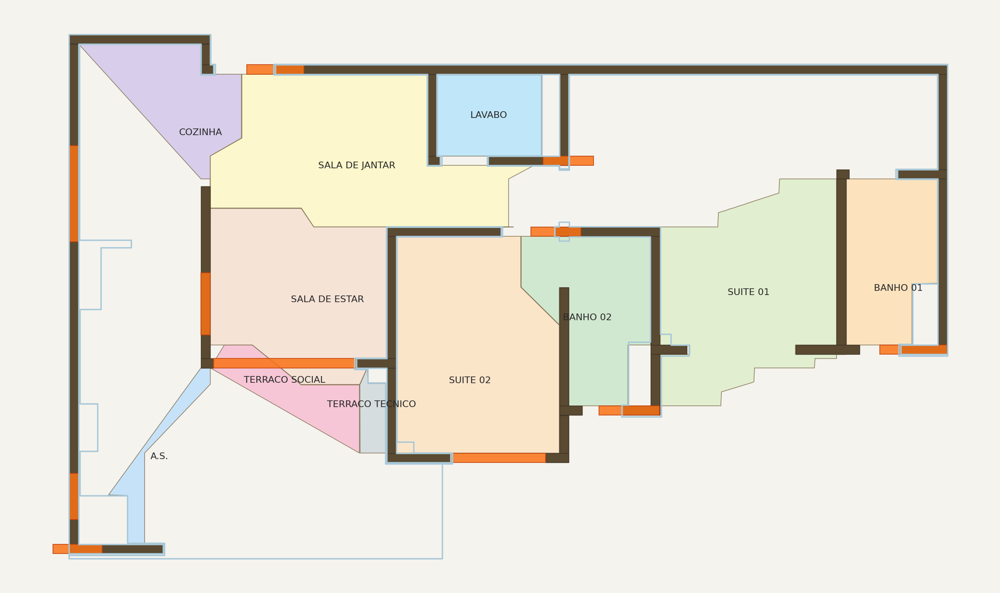
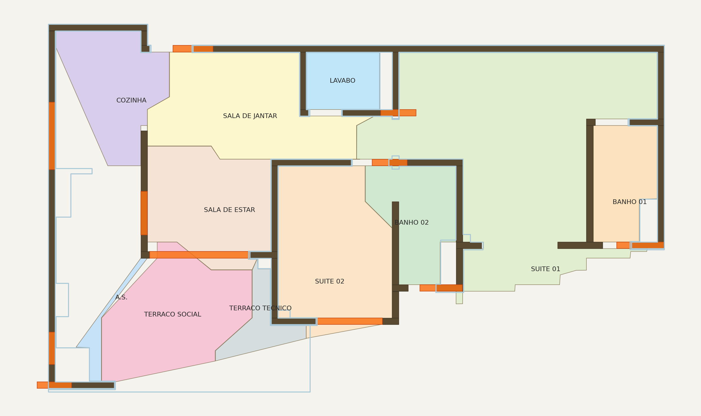

# FP-012 spike results — `--use-concave-hull` flag (2026-05-07)

> Companion to `2026-05-07_planta_74_suite01_polygon_leakage.md`
> (the bug diagnostic). This file captures the EMPIRICAL results
> of Option A (alpha-shape / `shapely.concave_hull`) implemented
> behind a default-off flag in `tools/rooms_from_seeds.py`.

## Sweep summary on planta_74

Default (`cv2.convexHull`, no flag): SUITE 01 = **69.91 m²**, sum
of all 11 rooms = **182.09 m²**. The runaway is SUITE 01 absorbing
the unwalled exterior strip on the right side of the apartment.

`--use-concave-hull --concave-hull-ratio R` results:

| ratio | SUITE 01 | SUITE 02 | BANHO 02 | COZINHA | sum 11 rooms |
|------:|---------:|---------:|---------:|--------:|-------------:|
| 0.20 | 16.08 | 14.21 | 6.24 |  2.23 |  69.5 |
| 0.25 | 17.53 | 14.21 | 6.24 |  2.23 |  76.4 |
| **0.30** | **18.61** | **14.35** | **6.24** |  **5.23** |  **83.3** |
| 0.35 | 19.04 | 14.35 | 6.24 |  5.23 |  91.3 |
| 0.40 | 26.31 | 14.35 | 6.24 |  5.23 |  98.6 |
| 0.50 | 26.75 | 14.38 | 6.24 |  8.80 | 104.8 |
| **0.55** | **35.64** | **15.16** | **6.24** |  **8.80** | **115.7** |
| 0.60 | 35.64 | 15.35 | 6.24 |  8.80 | 116.1 |
| 0.70 | 35.64 | 15.35 | 6.24 | 11.34 | 126.5 |
| 1.00 | 69.91 | 32.03 | 6.24 | 11.34 | 182.09 (= convex hull baseline) |

ratio=1.0 reproduces the convex-hull baseline exactly (sanity).

## Visual comparison

**Default (convex hull) — see `2026-05-07_planta_74_suite01_polygon_leakage.png`**:
SUITE 01 is the giant light-green polygon engulfing the right
half of the apartment.

**`--use-concave-hull --concave-hull-ratio 0.30`**

SUITE 01 collapses to a tight L-shaped polygon hugging its actual
walls (~18.6 m²). Cost: COZINHA, A.S., TERRACO TECNICO and SALA
DE JANTAR also tighten — some sliver clipping visible in COZINHA's
diagonal cut and A.S. becoming a thin wedge.

**`--use-concave-hull --concave-hull-ratio 0.55`** (compatibility-leaning)

SUITE 01 still leaks somewhat (~35.6 m²) but is bounded; no longer
the runaway. Other rooms preserve closer-to-baseline shapes. SALA
DE JANTAR and LAVABO unchanged. This is the safest "first promote
to default" candidate IF the goal is minimal disruption.

## Recommendation

For the spike PR (this PR): default flag value `0.30` to make the
fix's intent visible. Real promotion to default-on should:

1. Pick a ratio after rerunning the GT (currently calibrated on
   convex-hull numbers from PR #48 and the Cycle 7 expansion PR).
2. Update `tests/baselines/planta_74.json` in a single dedicated
   PR explaining every count delta.
3. Re-render `docs/diagnostics/` and `docs/preview/example_top.png`
   with the new default and update CLAUDE.md §10.

## Validation evidence

- `pytest tests/test_planta_74_truth_gate.py + coherence + micro` →
  **56/56 PASS** (default-off path; algorithm change behind flag,
  no behavioral change for current callers)
- `pytest tests/test_rooms_from_seeds_concave_hull.py` → **4/4 PASS**
  (synthetic L-shape unit tests; convex baseline preserved,
  concave shrinks, ratio=1.0 matches convex within 5%, empty
  walls graceful fallback)
- Full in-scope suite (excluding pre-existing raster + dashboard
  failures per CLAUDE.md §10): **519/519 PASS** + 8 skipped (data
  fixtures not run on this machine)

## Why default-off

- Existing baselines (`tests/baselines/planta_74.json`,
  `ground_truth/planta_74_micro.json`, smoke gate count assertions)
  are calibrated against the convex-hull behavior. Flipping default
  to on without a coordinated baseline update would fire the gates.
- CLAUDE.md §1 marks the geometry surface as hard-rule guarded.
  Behind-the-flag landing keeps the change reversible by anyone
  who pulls without opting in.
- Tightening the envelope is *better* but not perfect — at low
  ratios it can cut into rooms (visible in the 0.30 preview).
  Default-off lets the project iterate on ratio selection, GT
  recalibration, and possibly Option B (soft-barrier outer
  outline) before committing.
