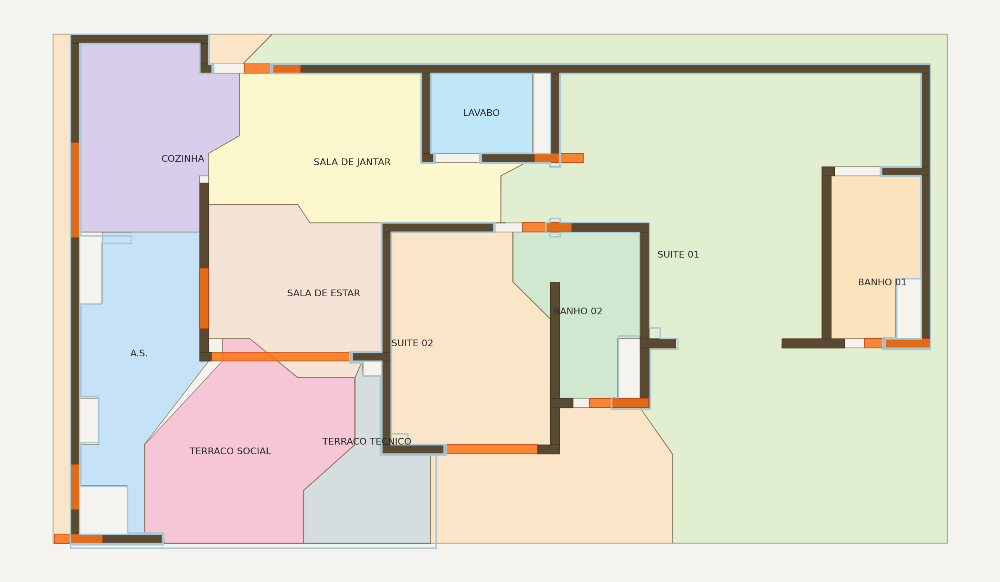

# SUITE 01 polygon leakage on planta_74 (2026-05-07)

> Diagnostic, not a fix. Per `CLAUDE.md §1` the algorithm in
> `tools/rooms_from_seeds.py` is a hard-rule guarded surface
> (geometry / topology). Any change requires explicit human approval
> and a separate PR.

## Symptom

`SUITE 01` polygon area = **69.91 m²** (canonical run
`runs/feature_room_context_2026_05_06/consensus_with_room_context.json`,
re-confirmed today on a fresh build of `planta_74.pdf`). The
apartment is nominally **74 m²** total. Sum of all 11 room polygons
on this run = **182.09 m²** (≈ 2.46× the nominal floor area), with
SUITE 01 carrying the largest single excess.

Visual confirmation in the top-down preview rendered today:



The light green area labelled "SUITE 01" extends well past any
visible structural wall — it absorbs:

- the open exterior strip on the right side of the planta
  (between the labelled body of the apartment and the BANHO 01 wall);
- the vertical corridor / circulation between the SUITE 02 / BANHO 02
  cluster and the BANHO 01 cluster;
- a small wedge of the bottom-right exterior overlapping
  TERRACO TECNICO.

By contrast, every *other* room polygon overlaps **zero** with
SUITE 01 (verified via `shapely`), so SUITE 01 is not stealing
labelled territory — it is claiming the **unlabelled empty area**
inside the wall convex hull.

## Down-stream impact

1. `tools/micro_truth_gate` reports BANHO 02 adjacent to
   `[LAVABO, SUITE 01, SUITE 02]`. Architecturally only `SUITE 02`
   should be there. The BANHO 02 ↔ SUITE 01 spurious edge comes
   from opening `o010` whose `evidence.room_left/right` is
   `BANHO 02 / SUITE 01` because SUITE 01's polygon laps over
   the wall hosting that opening.
2. The Cycle 7 ground-truth expansion (PR
   `feature/micro-truth-expand-planta-74-cycle7`) had to omit a
   COZINHA adjacency assertion for the same family of reasons —
   the only opening detected for COZINHA classifies its adjacent
   room as SUITE 02, which sits in the same exterior-bleed zone.
3. Any downstream consumer of polygon area (m² for furniture
   layout, ABNT minimums, floor-plate reports) gets a wildly
   inflated SUITE 01 number.

## Root cause hypothesis

`tools/rooms_from_seeds.py::detect_rooms` (Voronoi/watershed branch,
lines 152–219) builds an interior mask using
`cv2.convexHull(wall_pts)` (lines 164–169) and then runs watershed
seeded by each room label's `seed_pt`. Walls are treated as
hard barriers; everything inside the convex hull that is not a
wall is partitioned among seeds.

Consequence for a planta whose wall envelope is **not convex**
(this is the case for `planta_74` — there is an L/C-shaped notch
on the right side where the BANHO 01 sits at the far edge with a
wide unclaimed exterior between it and the rest of the apartment):
the convex hull spans the whole bounding rectangle and the
unwalled exterior strip becomes interior, then gets watershed-
assigned to whichever seed is closest. SUITE 01's seed `(434, 610)`
is the nearest seed to that strip → SUITE 01 absorbs it.

This is consistent with the existing comment at line 156–159:

> Clipped to the convex hull of the wall network so rooms don't
> bleed off the building footprint where exterior peitoril is
> unwalled.

The convex-hull clip is doing what was intended — it just isn't
tight enough for non-convex envelopes.

## Three candidate fix paths (each needs a separate PR)

### A. Tighter envelope: alpha-shape (concave hull) instead of convex hull

Replace `cv2.convexHull(wall_pts)` (lines 167) with a concave-hull
estimator (e.g. `shapely.concave_hull` or alpha-shape) so the
interior mask follows the actual non-convex wall envelope.

- Pros: minimal API change, single line replacement, intuitive.
- Cons: `concave_hull` requires `shapely >= 2.0` (already a dep)
  but tuning the `ratio` parameter is sensitive; risk of
  shrinking the hull *inside* the building if walls are sparse
  in some interior region.
- Validation needed: re-run plan/micro/Ruby gates on planta_74
  + every other corpus PDF before merging; expect SUITE 01 to
  drop near 25–30 m².

### B. Soft-barrier exterior wall

Add the building's outer outline as a `soft_barrier` (the same
mechanism already used for peitoril/grade in
`add_soft_barriers`, lines 66–88). Where there is no structural
wall, the soft barrier fences the watershed.

- Pros: zero algorithm change. Reuses existing soft-barrier code.
- Cons: requires extracting the outer outline reliably from the
  PDF — non-trivial (the outline is the union of the longest
  rectangles touching the bbox edge). Adds one stage to the
  vector pipeline.
- Validation: same as A.

### C. Per-room area cap with watershed re-clip

Post-process the watershed output: any room whose flood area
exceeds, say, `2× max(other rooms)` triggers a second pass that
clips it via a stricter local mask (e.g., medial-axis-aware
shrinking). Refuses to emit a room polygon larger than `0.45 ×
envelope_area_px` (the same threshold already used in the
non-Voronoi flood branch on line 227).

- Pros: surgical, only fires on outliers.
- Cons: hides the underlying geometry problem; risks emitting a
  truncated SUITE 01 polygon that no longer hugs the walls.
- Validation: same as A; plus a regression assert in
  `tests/test_planta_74_truth_gate.py` that
  `max(rooms_areas_m2) < 50`.

## Recommended next step

Spike Option **A** behind a `--use-concave-hull` flag in
`tools.rooms_from_seeds` (default off) so the existing baseline
remains stable. Land the flag on a feature branch, re-render the
planta_74 top preview, and compare visually + by area sum. Promote
the flag default to `on` only after the baseline JSON
(`tests/baselines/planta_74.json`) is updated in a single dedicated
PR explaining the geometry shift.

## Reproduce

```
python -m tools.build_vector_consensus planta_74.pdf \
       --out tmp/c0.json --detect-openings
python -m tools.extract_room_labels planta_74.pdf --out tmp/labels.json
python -m tools.rooms_from_seeds tmp/c0.json tmp/labels.json \
       --out tmp/c1.json --canonicalize-rooms \
       --room-canonicalization-tol 8
# inspect
python -c "
import json
c = json.load(open('tmp/c1.json'))
PT_TO_M = 0.03518518518518518
for r in c['rooms']:
    a = (r.get('area_pts2') or 0) * PT_TO_M*PT_TO_M
    print(f'{r[\"name\"]:<20} {a:>7.2f} m²')
"
```

## See also

- `tests/test_planta_74_truth_gate.py` — counts only, no area cap
  (does not catch this regression yet)
- `ground_truth/planta_74_micro.json` — Cycle 7 added BANHO 02 /
  COZINHA / SUITE 02 with notes referencing this exact bug
- `docs/learning/failure_patterns.md` — FP-XXX entry to be added
  in this same PR
