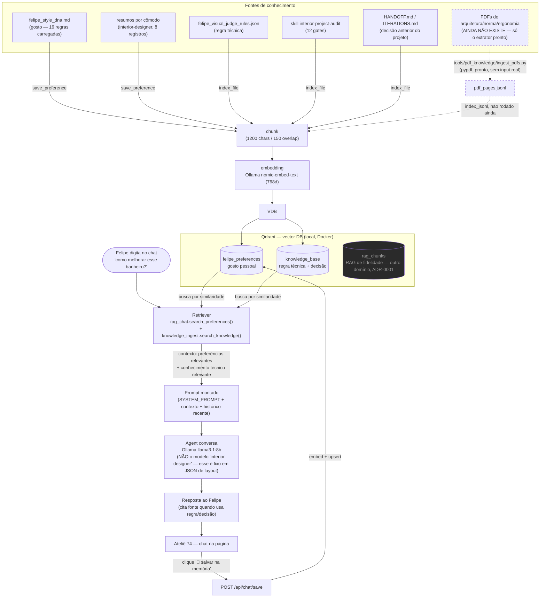

# Fluxograma — RAG do Ateliê 74 (chat + memória vetorial)

> Renderiza direto no GitHub (bloco ```mermaid). Ver ADR-0002 pro texto corrido.
> Baseado no diagrama que o Felipe desenhou em texto (Knowledge Base → chunks →
> embedding → Vector DB → Retriever → Agent) — este documenta o que ficou
> implementado de fato, com os módulos reais do repo.



## Legenda

- **Linha sólida** = caminho implementado e testado ponta a ponta nesta sessão.
- **Linha tracejada** = peça que existe no código mas ainda não tem dado real
  fluindo (falta o Felipe fornecer PDFs em `references/pdfs/`).
- **`rag_chunks`** (cinza) é um domínio separado, do pipeline de fidelidade
  PDF→SKP (ADR-0001) — não é tocado por este fluxo, só compartilha a mesma
  instância Qdrant.
