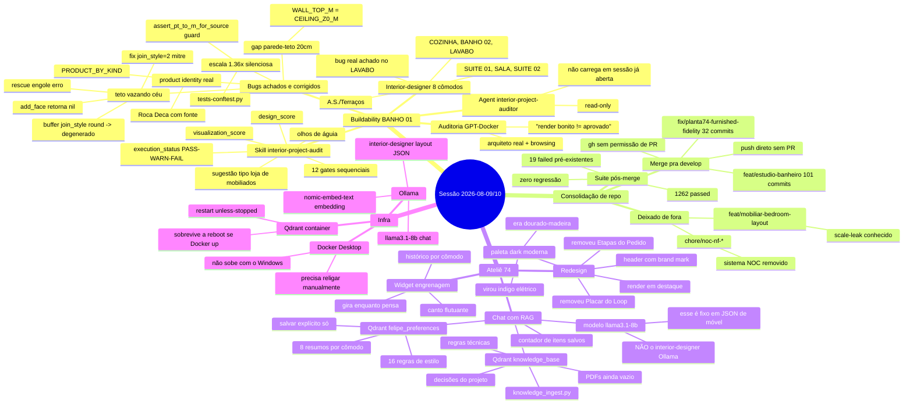

# Mapa mental — sessão 2026-08-09/10 (BANHO 01 buildability + Ateliê 74)

> Renderiza direto no GitHub (bloco ```mermaid). Ver ADR-0002 pro texto corrido.


```mermaid
mindmap
  root((Sessão 2026-08-09/10))
    Buildability BANHO 01
      Auditoria GPT-Docker
        arquiteto real + browsing
        "render bonito != aprovado"
      Skill interior-project-audit
        12 gates sequenciais
        design_score
        visualization_score
        execution_status PASS-WARN-FAIL
        olhos de águia
        sugestão tipo loja de mobiliados
      Agent interior-project-auditor
        read-only
        não carrega em sessão já aberta
      Bugs achados e corrigidos
        escala 1.36x silenciosa
          assert_pt_to_m_for_source guard
          tests-conftest.py
        teto vazando céu
          buffer join_style round -> degenerado
          add_face retorna nil
          rescue engole erro
          fix join_style=2 mitre
        gap parede-teto 20cm
          WALL_TOP_M = CEILING_Z0_M
        product identity real
          PRODUCT_BY_KIND
          Roca Deca com fonte
      Interior-designer 8 cômodos
        SUITE 01, SALA, SUITE 02
        COZINHA, BANHO 02, LAVABO
        A.S./Terraços
        bug real achado no LAVABO
    Consolidação de repo
      Merge pra develop
        feat/estudio-banheiro 101 commits
        fix/planta74-furnished-fidelity 32 commits
        push direto sem PR
        gh sem permissão de PR
      Deixado de fora
        feat/mobiliar-bedroom-layout
          scale-leak conhecido
        chore/noc-nf-*
          sistema NOC removido
      Suite pós-merge
        1262 passed
        19 failed pré-existentes
        zero regressão
    Ateliê 74
      Redesign
        removeu Etapas do Pedido
        removeu Placar do Loop
        render em destaque
        header com brand mark
        paleta dark moderna
          era dourado-madeira
          virou indigo elétrico
      Widget engrenagem
        canto flutuante
        gira enquanto pensa
        histórico por cômodo
      Chat com RAG
        modelo llama3.1-8b
          NÃO o interior-designer Ollama
          esse é fixo em JSON de móvel
        Qdrant felipe_preferences
          16 regras de estilo
          8 resumos por cômodo
          salvar explícito só
        Qdrant knowledge_base
          knowledge_ingest.py
          regras técnicas
          decisões do projeto
          PDFs ainda vazio
        contador de itens salvos
    Infra
      Docker Desktop
        não sobe com o Windows
        precisa religar manualmente
      Qdrant container
        restart unless-stopped
        sobrevive a reboot se Docker up
      Ollama
        nomic-embed-text embedding
        llama3.1-8b chat
        interior-designer layout JSON
```
