# Box Diagrams

Diagramas de fluxo simples (Mermaid) pra explicar os conceitos sem abrir
código. Ver [`architecture-lessons.md`](architecture-lessons.md) para o
racional completo de cada um.

## 1. Fluxo errado (o bug que motivou esta sessão)

Optimizer e CI decidem "essa posição é válida?" com implementações
DIFERENTES — o optimizer aprova, o CI reprova a mesma posição.

```mermaid
flowchart LR
    subgraph Optimizer["Optimizer (busca de posição)"]
        H["Heurística própria<br/>(proxy: distância ao centroide)"]
    end
    subgraph CI["CI (validação real)"]
        G["Gate canônico<br/>(circulation_gate.gate)"]
    end
    H -->|"'parece bom'"| R1["candidato escolhido"]
    R1 --> G
    G -->|"reavalia com a regra REAL"| F["FAIL"]

    style H fill:#4a2020,stroke:#a04040
    style F fill:#4a2020,stroke:#a04040
```

## 2. Fluxo correto (depois da correção)

Optimizer e CI consomem a MESMA implementação canônica — nunca podem
divergir porque não há duas regras, há uma.

```mermaid
flowchart TB
    C["Canonical Gate<br/>tools/circulation_gate.py::gate()"]
    C --> O["Optimizer<br/>(escolhe candidato QUE passa no gate)"]
    C --> CI["CI<br/>(reavalia o estado final no MESMO gate)"]
    O -->|"placement_decision<br/>{candidate_id, canonical_gate,<br/>gate_result, score}"| P[("provenance<br/>persistida")]
    P -.->|"CI nunca confia<br/>na provenance sozinha —<br/>sempre REAVALIA"| CI

    style C fill:#1a3a1a,stroke:#4a9a4a
```

## 3. Arquitetura agêntica (por que o gate não depende do agente)

```mermaid
flowchart TB
    U["USER"] --> A["AGENT<br/>(interior-designer, interior-pm, ...)"]
    A --> S["usa SKILLS<br/>(interior-project-audit, ...)"]
    A --> RAG["consulta RAG<br/>(Qdrant — recuperação, não autoridade)"]
    A --> CAND["produz candidato<br/>(layout, posição, decisão)"]
    CAND --> GT["GATE / TEST<br/>(determinístico, independente do agente)"]
    GT -->|PASS| OK["aceito"]
    GT -->|FAIL| NO["rejeitado"]

    style GT fill:#1a3a1a,stroke:#4a9a4a
```

O ponto central: o GATE não sabe (nem precisa saber) que um agente existiu.
Ele validaria a mesma geometria vinda de um humano, de um script, ou de
qualquer agente futuro — a correção não depende de "confiar" no agente.

## 4. Hierarquia de autoridade de conhecimento

```mermaid
flowchart TB
    CODE["CODE / CONFIG / TESTS<br/>(fonte executável — o que roda)"]
    ADR["ADR / HANDOFF<br/>(fonte de decisão — POR QUE)"]
    RAG["RAG INDEX<br/>(Qdrant — recuperação, PODE ficar stale)"]
    LLM["LLM CONTEXT<br/>(síntese em cima do que foi recuperado)"]

    CODE -->|"vence em qualquer<br/>conflito"| ADR
    ADR -->|"racional indexado por"| RAG
    RAG -->|"contexto pra"| LLM

    style CODE fill:#1a3a1a,stroke:#4a9a4a
    style RAG fill:#3a3010,stroke:#9a8020
```

Regra prática: se o Qdrant recuperar um threshold diferente do que está no
código, o código vence — sempre. `rag_required_for_ci: false` é literal —
desligar GPT/Claude/Qdrant não impede o CI de decidir PASS/FAIL sozinho.

## 5. Semantic contract — de onde a decisão vem

```mermaid
flowchart LR
    B["Builder<br/>(bathroom_layout.py, etc.)"] -->|"kind, module"| REG["Registro central<br/>KIND_REGISTRY / MODULE_REGISTRY<br/>(core/spatial_semantics.py)"]
    REG -->|"geometry_intent"| GATES["3 gates consomem<br/>o MESMO contrato"]
    GATES --> CG["circulation_gate<br/>(interaction_policy.circulation)"]
    GATES --> GS["geometry_sanity<br/>(shape_policy)"]
    GATES --> FO["furniture_overlap_gate<br/>(interaction_policy.furniture_overlap)"]

    style REG fill:#1a3a1a,stroke:#4a9a4a
```

Antes: cada gate (CG/GS/FO) tinha sua própria heurística (altura Z, bool
solto, substring) pra responder "essa peça bloqueia/colide/é decorativa?".
Depois: os três consultam o MESMO registro central — um bug corrigido ali se
propaga pros três, não precisa ser re-descoberto em cada gate.
