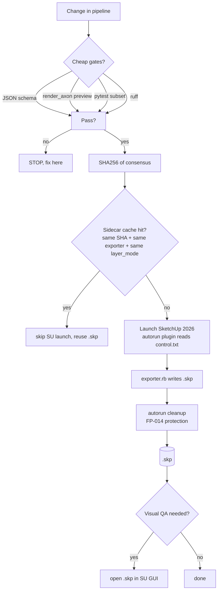

# Pipeline overview — PDF → SKP

> **Status:** Canonical (2026-05-24).
>
> Read this before reading specific stage docs. It's the map; the
> stage docs are the territory. Companion: [`CLAUDE.md`](../CLAUDE.md)
> §10 for the canonical baselines, [`OVERVIEW.md`](../OVERVIEW.md) for
> cross-machine setup.

The active production pipeline is the **vector track**. The raster
track is preserved for historical comparison but is OUTDATED per
`CLAUDE.md` §10 — don't add new features to it.

## High-level flow (vector track)

```mermaid
flowchart LR
    PDF[planta.pdf] --> EXTRACT[build_vector_consensus.py<br/>+ extract_room_labels.py<br/>+ extract_openings_vector.py]
    EXTRACT --> CONSENSUS[(consensus_model.json)]
    HUMAN[human-painted PNGs<br/>walls / soft_barriers / openings] --> APPLY[apply_human_walls.py<br/>apply_human_soft_barriers.py<br/>apply_human_openings.py]
    CONSENSUS --> APPLY
    APPLY --> ROOMS[rooms_from_seeds.py<br/>polygonize OR voronoi]
    ROOMS --> CONSENSUS_FINAL[(consensus_with_human_walls_<br/>and_soft_barriers.json)]
    CONSENSUS_FINAL --> SMOKE[smoke_skp_export.py<br/>gates A→F]
    SMOKE -->|exporter=consume| CONSUME[consume_consensus.rb<br/>1 group per wall]
    SMOKE -->|exporter=plan-shell| PLANSHELL[build_plan_shell_skp.py + .rb<br/>1 PlanShell_Group, shapely union]
    CONSUME --> SKP[(.skp)]
    PLANSHELL --> SKP
    SKP --> INVARIANTS[build_geometry_invariants_report.py]
    SKP --> AUDIT[audit_soft_barriers.py<br/>diagnose_room_polygons.py]
    SKP --> SPEC[spec_harness.py<br/>21 contracts on planta_74]
    INVARIANTS --> EVIDENCE[evidence/<br/>iso PNG + top PNG + overlays + reports]
    AUDIT --> EVIDENCE
    SPEC --> EVIDENCE
```



## Stage cheat-sheet

| Stage | Reads | Writes | Tool |
|---|---|---|---|
| Vector extract | `planta_74.pdf` | walls + thickness | `tools/build_vector_consensus.py` |
| Label extract | PDF text page | labels list (seed positions) | `tools/extract_room_labels.py` |
| Openings extract | PDF vector paths | openings (interior_door / window / glazed_balcony) | `tools/extract_openings_vector.py` |
| Human overrides | annotation PNG | injects walls / SBs / openings | `tools/apply_human_*.py` |
| Rooms from seeds | walls + labels + (optional) SBs | rooms[] | `tools/rooms_from_seeds.py` |
| Smoke harness | consensus | gates A–F | `scripts/smoke/smoke_skp_export.py` |
| **SKP exporter (production)** | consensus | `.skp` | `tools/consume_consensus.rb` (1 Group per wall) |
| **SKP exporter (experimental)** | consensus | `.skp` | `tools/build_plan_shell_skp.{py,rb}` (1 PlanShell_Group via shapely union) |
| Invariants report | `.skp` | per-group height/material/bbox PASS/WARN/FAIL | `tools/build_geometry_invariants_report.py` |
| SB audit | consensus + walls | per-SB keep/warn/reject | `tools/audit_soft_barriers.py` |
| Room polygon diagnostic | consensus | per-room suspicious_merge flag | `tools/diagnose_room_polygons.py` |
| Spec harness | consensus + reports + spec YAMLs | pass/warn/fail per contract | `tools/spec_harness.py` |

## The SketchUp Rule (CLAUDE.md §3)



Cheap gates run on every PR. Expensive SU launch only when:
1. cheap gates passed;
2. consensus changed (SHA256 mismatch);
3. caller didn't pass `--skip-skp`.

## Two exporter paradigms — when to use which

| Trait | `consume_consensus.rb` (production) | `build_plan_shell_skp.{py,rb}` (experimental) |
|---|---|---|
| Group strategy | 1 `Sketchup::Group` per wall | 1 `PlanShell_Group` containing the unioned shell |
| Corners | Per-wall overlap at each corner | Merged by `shapely.unary_union` |
| Geometry origin filter | CARVING_OPENING_ORIGINS check | CARVING_ORIGINS frozenset (same set) |
| Phase 2 visual parity | Yes (doors, windows, glazed, passage) | Yes (Phase 2 ported, FP-015 fix applied) |
| Layer-mode flag | n/a | `wall_shell_only` → `with_floors` → `with_soft_barriers` → `with_doors` → `full` |
| Smoke gate | `--exporter consume` (default) | `--exporter plan-shell` (opt-in) |
| Production status | **DO NOT MODIFY** without ADR approval (CLAUDE.md §1.4) | Experimental; safe to iterate |

ADR-003 documents the plan-shell rationale. Both exporters consume
the same `consensus_model.json` schema (CLAUDE.md §1.3 — locked).

## Where each artefact lives

```
fixtures/planta_74/
  ├── consensus_with_human_walls_and_soft_barriers.json   ← canonical input
  └── human_*_annotation.png                              ← human override sources

runs/                                                      ← gitignored
  ├── planta_74_plan_shell/                                ← plan-shell output
  │   ├── model.skp, model_iso.png, model_top.png
  │   ├── geometry_report.json, geometry_invariants_report.json
  │   ├── soft_barrier_audit_report.json (+ 3 overlays)
  │   └── room_polygon_diagnostic_report.json (+ r001 overlay)
  ├── planta_74_plan_shell_layers/                         ← 5 progressive layers
  │   └── {wall_shell_only,with_floors,with_soft_barriers,with_doors,full}/
  ├── floor_r001_split_before_after/                       ← Frente 3 evidence
  └── spec_harness_demo/                                   ← spec_harness ad-hoc reports

tests/baselines/planta_74.json                             ← versioned truth gate
ground_truth/planta_74_micro.json                          ← external truth (SALA DE ESTAR)
```

## Failure-mode index (where each FP fires)

| FP | Stage | Symptom | Mitigation |
|---|---|---|---|
| FP-001 | smoke ordering | SU launch when cheap gate would have caught it | smoke_skp_export.py gate order |
| FP-005 | consume_consensus | geometry triplication on multi-run | `Sketchup.quit` + `reset_model` |
| FP-006 | plan_shell SB rendering | peitoril rendered ON wall | 3-point overlap filter |
| FP-012 | rooms_from_seeds (raster) | SUITE 01 leaks across BANHO 02 | concave_hull default |
| FP-014 | SU autorun cleanup | orphan control.txt clobbers next launch | `disarm_sketchup_autoruns.py` |
| FP-015 | plan_shell DoorLeaf | leaf rotated around off-axis pivot | symmetric `hinge_world` ternary |
| FP-016 | rooms_from_seeds (polygonize) | A.S.\|TER SOC\|TER TEC merge | near-miss SB extension + Voronoi fallback |

`docs/learning/failure_patterns.md` has the full entry per FP;
`tests/test_failure_patterns_regression_catalog.py` enforces every
FP has ≥ 1 regression test.

## Where to extend the pipeline

If you want to add a **new extractor** (e.g., for a different
floorplan style), the additions hang off the left side of the
diagram:

- Vector-track extractor → `tools/build_<name>_consensus.py`
- Human override channel → `tools/apply_<name>.py`

If you want to add a **new validation layer**, the additions hang
off the right side:

- Geometry rule → `tools/build_geometry_invariants_report.py` rule set
- Architectural contract → `specs/<planta>/<aspect>.spec.yaml`
- Visual evidence → `docs/protocols/visual_fidelity_gate_protocol.md`
  seven-artifact set

Don't put new things in the middle of the diagram without an ADR.
The `consensus_model.json` schema is the spine — bending it requires
explicit approval (CLAUDE.md §1.3).
