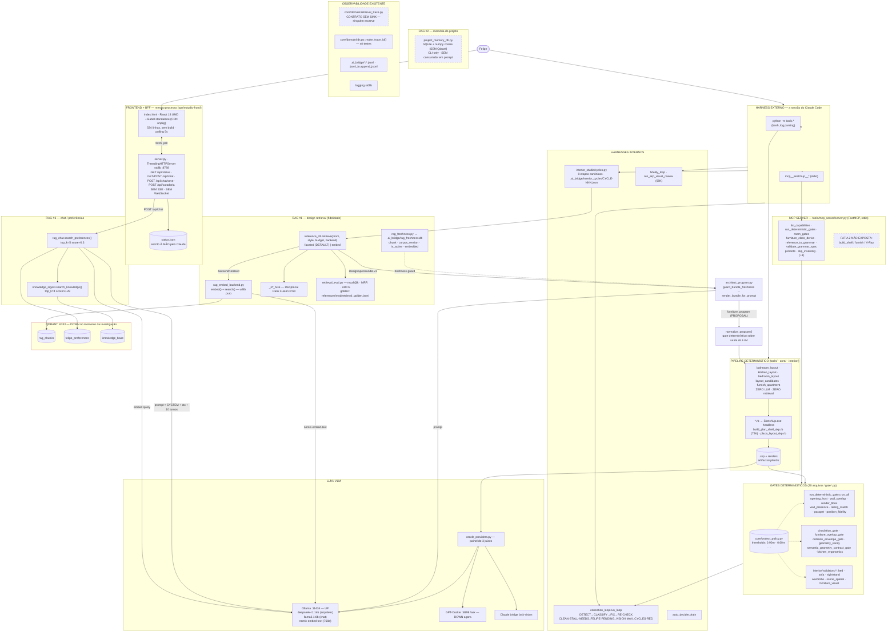

# AI Pipeline Inspector — arquitetura real, taxonomia e plano

> Investigação: 2026-08-26, sobre `develop` @ `3515cfd`. Toda afirmação foi
> confirmada por leitura direta do código — `arquivo:linha` quando aplicável.
>
> **Status: Fases 1, 2 e 3 LANDADAS** em `feat/ai-pipeline-inspector-observability`.
> Os call-sites estão instrumentados e uma run real produz trace completo.
> Segue **desligado por padrão** (`INSPECTOR=1` liga). Fases 4–10 pendentes:
> nenhuma UI foi construída — é deliberado.
>
> A §2 foi **reescrita** após correção conceitual do Felipe: RAG é categoria
> ampla (retrieval + augmentation + generation); a tecnologia do índice define o
> subtipo. A versão anterior classificava o caminho faceted como "não é RAG" —
> errado para o propósito da ferramenta.

---

## 1. Current Architecture — o que o sistema REALMENTE é hoje

### 1.1 Descoberta central

**Não existe um "backend do SketchUp MCP" no sentido de serviço.** O sistema é:

- uma **biblioteca de CLIs Python** (`tools/`, 146 arquivos) invocada por `python -m tools.X`;
- um **servidor MCP stdio** que expõe 9 verbos puros dessa biblioteca;
- um **front local descartável** (`ops/estudio-front/`, :8788) que é frontend **e** BFF no mesmo processo;
- **três** pipelines de RAG independentes, com corpora e collections diferentes;
- **Claude Code (a sessão) é o harness externo real** — a frase "crie um banheiro
  seguindo minhas preferências" não tem hoje nenhum receptor server-side.

### 1.2 Diagrama da arquitetura real



### 1.3 Inventário por camada (com evidência)

| Camada | Existe? | Onde | Nota |
|---|---|---|---|
| Frontend | Sim, 1 só | `ops/estudio-front/index.html` | React 18 UMD + Babel standalone via **CDN unpkg**; sem build; paleta bege quente (iFood-style), `:root` em `index.html:9-19` |
| BFF | Sim | `ops/estudio-front/server.py` | stdlib `ThreadingHTTPServer`, :8788, 7 rotas |
| Backend HTTP | **Não existe** | — | pipeline é CLI + MCP stdio |
| MCP | Sim | `tools/mcp_server/server.py` | FastMCP stdio, registrado em `E:\Claude\.mcp.json` como `sketchup`; 9 tools; fatia 2 (SketchUp real) **não exposta** |
| SketchUp | Sim | `tools/*.rb` + `-RubyStartup` headless | Python emite JSON → Ruby constrói |
| LLM | Sim, local | Ollama :11434 (**UP**) | deepseek-r1:14b, llama3.1:8b, nomic-embed-text |
| VLM / juízes | Sim | `oracle_providers.py`, `gpt_docker_visual_score.py` | GPT-Docker :8899 (**DOWN**), `/ask-vision` |
| RAG | Sim, **×3** | ver §2 | corpora e collections distintos |
| Qdrant | Sim | :6333 (**DOWN** agora) | 3 collections, 768d cosine, HTTP urllib puro |
| Embeddings | Sim | `nomic-embed-text` 768d | prefixos assimétricos `search_document:` / `search_query:` (`rag_embed_backend.py:38-40`) |
| Retrieval fns | Sim | `reference_db.retrieve` · `rag_chat.search_preferences` · `knowledge_ingest.search_knowledge` · `project_memory_db.search` | 4 funções, 3 pipelines |
| SSE / WebSocket | **NÃO EXISTE** | — | única atualização é **polling 5s** de `status.json` |
| Logs / tracing | Parcial | `logging` + `.ai_bridge/*.jsonl` + `cycles.json` | sem span, sem duração, sem correlação por run |
| Gates determinísticos | Sim, ~20 | `tools/*gate*.py` + `interior/validators/` | **formatos de saída heterogêneos** (ver §5) |
| Visual judge | Sim | `run_skp_visual_review.py` (69K), `oracle_providers.py` | painel de 3 juízes; veredito final é do Felipe |
| Preferências | Sim, ×2 | Qdrant `felipe_preferences` + `.claude/memory/felipe_style_dna.md` | um é vetorial, o outro é arquivo lido direto |
| Avaliação de RAG | Sim | `tools/retrieval_eval.py` + `references/eval/` | recall@6=**0.7225**, MRR=**0.90**, nDCG@6=**0.8083** (backend=faceted, n=8) |
| CI | Sim | `.github/workflows/ci.yml` | 3 jobs: pytest (2 passes de escala), gates determinísticos, MCP smoke+stdio. **`retrieval_eval` NÃO roda no CI** |

### 1.4 Sistemas parcialmente duplicados (achado importante)

1. **Três RAGs**, três corpora, três thresholds, três formatos de chunk:
   - `rag_chunks` (fidelidade) — chunk com `corpus_version`/`is_active`/`embedded`, freshness guard, RRF.
   - `felipe_preferences` (gosto) — sem versionamento de corpus, sem freshness, threshold hardcoded `0.3`.
   - `knowledge_base` (regra técnica/decisão) — idem, threshold `0.28`.
   - `project_memory_db` — **quarto** store (SQLite+numpy), sem Qdrant, **sem nenhum consumidor em prompt**.
2. **Duas fontes de "preferência do Felipe"**: a collection vetorial e `felipe_style_dna.md` lido direto por `architect_program.py:20`. A segunda é augmentation **sem retrieval**.
3. **Dois vocabulários de tipo de conhecimento**: `core/domain/knowledge_types.py` (KnowledgeType, com regra de precedência) e o `category` livre do `knowledge_ingest`. O primeiro é o contrato bom e **não é usado pelo RAG #3**.

---

## 2. Taxonomia de retrieval — RAG como categoria AMPLA

> **Correção do Felipe, 2026-08-26.** A primeira versão desta spec classificava
> `backend="faceted"` como "não é RAG" por não usar embedding/vector DB. Errado
> para o propósito da ferramenta. **RAG é o CICLO** — *retrieval de informação
> externa relevante* + *augmentation do contexto* + *generation*. A tecnologia
> do índice define o **subtipo**, não a pertinência à categoria.

Implementado em [`core/observability/taxonomy.py`](../../core/observability/taxonomy.py),
travado por [`tests/test_observability_taxonomy.py`](../../tests/test_observability_taxonomy.py).

### 2.1 Os cinco rótulos

| Rótulo | É RAG? | Definição |
|---|---|---|
| `VECTOR_SEMANTIC_RAG` | ✅ | Consulta virou embedding e buscou por similaridade num banco vetorial. |
| `FACETED_STRUCTURED_RAG` | ✅ | Consulta dinâmica sobre store **estruturado** (SQLite, facetas, tokens em disco). Sem embedding — o ciclo fecha do mesmo jeito. |
| `HYBRID_RAG` | ✅ | Dois ou mais recuperadores com rankings **fundidos** (RRF). |
| `RETRIEVAL_ONLY` | ❌ | Recuperou de verdade, mas **nenhuma geração consome**. Recuperador órfão: tem o R, falta A e G. |
| `STATIC_CONTEXT_INJECTION` | ❌ | Arquivo de caminho fixo lido inteiro. Aumenta contexto **sem recuperar**: nenhuma query, nenhuma seleção por relevância. |

### 2.2 Classificação DERIVADA, não asserida

`classify_retrieval()` deriva o rótulo dos fatos observados **naquela execução**:

```python
classify_retrieval(dynamic_query=..., index=IndexKind.VECTOR|STRUCTURED|FILE,
                   retrievers_fused=..., augments_context=..., feeds_generation=...)
```

Precedência: `STATIC` → `RETRIEVAL_ONLY` → `HYBRID` → `VECTOR` → `FACETED`.

Isso não é preciosismo. Quando o Qdrant cai — que é o estado **agora** — o
caminho `backend="embed"` degrada pro faceted. Um rótulo fixo por call-site
diria `HYBRID_RAG` e mentiria. O derivado diz `FACETED_STRUCTURED_RAG`, que é o
que de fato aconteceu. O Inspector existe pra mostrar isso.

### 2.3 Onde cada caminho real cai hoje

| Caminho | Rótulo | Evidência |
|---|---|---|
| `reference_db.retrieve(backend="faceted")` — **o default** | `FACETED_STRUCTURED_RAG` | consulta montada em `build_retrieval_query()`, ranking por facetas, resultado no prompt via `render_bundle_for_prompt` |
| `reference_db.retrieve(backend="embed")`, Qdrant no ar, com RRF | `HYBRID_RAG` | `reference_db.py:462` embed · `:463/:465` search · `:570` `_rrf_fuse` |
| idem, Qdrant fora | `FACETED_STRUCTURED_RAG` | `_embed_recall_chunks` devolve `[]` + nota de degradação; ranking segue faceted |
| `rag_chat.search_preferences()` | `VECTOR_SEMANTIC_RAG` | embed → `felipe_preferences` → `ctx` → llama3.1 |
| `knowledge_ingest.search_knowledge()` | `VECTOR_SEMANTIC_RAG` | embed → `knowledge_base` → mesmo `ctx` |
| `project_memory_db.search()` | `RETRIEVAL_ONLY` | embeda e ranqueia; nenhum prompt consome |
| `felipe_style_dna.md` via `read_text()` (`architect_program.py:20`) | `STATIC_CONTEXT_INJECTION` | caminho fixo, sem query |

### 2.4 O que segue fora da categoria por inteiro

Não é retrieval de nenhum tipo — nem órfão, nem estático:

| Componente | Categoria | Por quê |
|---|---|---|
| Todos os `*_gate.py` | `DETERMINISTIC` | Shapely + limiar de `core/project_policy.py`. `circulation_gate.py:305` compara `livre_atras_m` com `BEHIND_CHAIR_M`. Nenhum documento, nenhum modelo. |
| `furnish_apartment`, `bathroom_layout`, `kitchen_layout`, `layout_candidates` | `DETERMINISTIC` | brains de posicionamento; nenhuma referência a Ollama ou `reference_db` |
| `consensus_model.json` | `DETERMINISTIC` | fato estrutural imutável; excluído de propósito do vocabulário de conhecimento (`core/domain/knowledge_types.py:29-32`) |
| `architect_program.normalize_program()` | `DETERMINISTIC` | guardrail **sobre a saída do LLM** (remove cross-cômodo, injeta CORE) |
| `*.rb` / SketchUp | `TOOL` | construção geométrica |
| `cycles.py`, `status.json` | `OBSERVABILITY` | estado de processo |

---

## 3. Harness Boundary — duas camadas que nunca colapsam

`HarnessKind` separa explicitamente o que antes estava num balaio só:

| Rótulo | Quem | Observável? |
|---|---|---|
| `EXTERNAL_AGENT_RUNTIME` | A sessão do Claude Code. Recebe "crie um banheiro seguindo minhas preferências", lê o gate, escolhe a próxima tool. | **Não.** O Inspector vê só os efeitos: tool chamada, arquivo escrito, evento emitido. |
| `APPLICATION_HARNESS` | `correction_loop.run_loop`, `interior_studio.cycles`, `auto_decider.drain`, `fidelity_loop`. | **Sim, integralmente.** Ciclo, retry, fix aplicado, fix revertido, estado terminal. |

Camadas de apoio dentro do `APPLICATION_HARNESS`: `finding_router` (roteia
achado → fix / visão / Felipe) decide, não gera.

### 3.1 Restrição dura: nada de chain-of-thought

"Por que o agente decidiu isso" é respondido **reconstituindo sinal externo**,
nunca lendo raciocínio do modelo. `DecisionEvidence` tem exatamente cinco slots:

```
trigger_event   o evento que causou a decisão
gate_result     o veredito determinístico que estava na mesa
context_refs    IDs do contexto disponível (chunk_id, spanId) — REFERÊNCIAS, não texto
tool_called     a ação externa disparada
effect          o efeito produzido, medível
```

`FORBIDDEN_EVIDENCE_FIELDS` lista os nomes proibidos (`reasoning`, `rationale`,
`thought`, `chain_of_thought`, `scratchpad`, …) e há **dois** testes travando
isso: um inspeciona os campos do dataclass, outro confirma que a allowlist de
redaction descarta `reasoning` mesmo se alguém passar no `meta`.

---

## 4. Categorias de componente

Sete, com card de Learning Mode em `taxonomy.py` — fonte única, consumida pela
UI (nunca prosa hardcoded no HTML, que divergiria do código):

`RAG` · `LLM` · `HARNESS` · `TOOL` · `DETERMINISTIC` · `DATABASE` · `OBSERVABILITY`

Cada card responde três coisas: o que a etapa fez, **se é RAG ou não e por quê**,
e os números daquela run. Exemplo do card de `DATABASE`:

> O banco vetorial **não é** o RAG. Ele é uma PEÇA do RAG: sem query, sem
> contexto e sem geração em volta, é só um banco.

## 5. Observability Gap Analysis

### 5.1 O que já dá pra observar

| Sinal | Onde | Qualidade |
|---|---|---|
| Chunks recuperados no RAG #1 | `bundle["retrieved_chunks"]` → `{source, chunk_id, source_type, confidence}` | **Bom** — já é auditável, já tem score |
| Corpus version | `bundle["rag_corpus_version"]` | Bom |
| Freshness (rejected/stale) | `bundle["freshness"]` (`architect_program.guard_bundle_freshness`) | **Ótimo** — já sabe qual chunk foi descartado e por quê |
| Degradação honesta | `bundle["notes"]` | Bom — texto |
| Chunks usados no RAG #3 | `chat()` → `context_used`, `kb_used` | Parcial (texto truncado, sem score) |
| Veredito de gate | retorno de cada gate | **Heterogêneo** (ver 5.3) |
| Etapa do processo | `.ai_bridge/interior_cycles/CYCLE-NNN.json` | Grosso (8 etapas, sem duração) |
| Métricas de retrieval | `retrieval_eval.py` + `references/eval/retrieval_baseline.json` | **Real e medido** — mas offline, não por run, e fora do CI |

### 5.2 O que é INVISÍVEL hoje

| Invisível | Consequência |
|---|---|
| **`runId` / `traceId`** | Impossível correlacionar embedding→qdrant→prompt→tool→gate de uma mesma execução. `make_trace_id()` existe e **ninguém chama** fora de testes. |
| **`RetrievalTrace` nunca é gravado** | O contrato existe (`core/domain/retrieval_trace.py`) e o docstring diz literalmente que o sink "é trabalho da Fase D, não desta". Fase D nunca aconteceu. |
| **Latência de qualquer etapa** | `RetrievalStage.latency_ms` é sempre `None`. Nenhum `perf_counter` no caminho de retrieval/LLM. |
| **Tokens de entrada/saída** | Nenhuma chamada Ollama conta tokens. `LLMStage.prompt_tokens` sempre `None`. |
| **Chunk rejeitado por threshold** | `search_preferences` filtra `score > 0.3` numa list-comp e **descarta o rejeitado** — a informação "veio 9, entraram 4" é perdida no ato. |
| **Composição do contexto final** | O prompt é concatenação de strings (`rag_chat.py:192`, `architect_program.render_bundle_for_prompt`). Ninguém sabe quantos % vieram de RAG vs system prompt vs histórico. |
| **Correlação tool → entidade SketchUp** | O `.rb` cria entidades; o gate lê boxes. Não há id compartilhado entre "o que a tool criou" e "o que o gate reprovou". |
| **Retry / correção do harness** | `correction_loop` sabe internamente, mas não emite evento; o ciclo só aparece no arquivo final. |
| **Uso do Qdrant** | Nenhum contador de queries/min, nenhuma latência registrada. |
| **Streaming** | Não existe. O front descobre mudança por polling de 5s de um JSON escrito à mão. |

### 5.3 Gates: formatos de saída incompatíveis (bloqueia normalização)

```
run_deterministic_gates.run_all  → {"overall": "PASS|FAIL|INCOMPLETE", "gates": {...}}
circulation_gate                 → {"result": "PASS|FAIL", "room": ..., "checks": {...}}
furniture_overlap_gate           → {"result": ..., "room": ..., "fails": [...], "warns": [...]}
semantic_geometry_contract_gate  → {"overall": ..., "n_parts": ..., "n_pass": ...}
opening_host / wall_overlap      → {"verdict"|"overall": ..., "n_fail": ..., "n_openings": ...}
```

Qualquer camada de eventos precisa de um **adapter de normalização** (`gate_verdict.py`
e `gate_util.py` já existem e são o lugar natural pra isso).

---

## 6. Proposed Event Model

### 6.1 Envelope (um só, versionado)

```jsonc
{
  "v": 1,
  "runId": "run_20260826T143012Z_a1b2c3",   // ULID-ish, ordenável
  "traceId": "8f21a0…",                      // core.domain.ids.make_trace_id()
  "spanId": "s07",
  "parentSpanId": "s03",
  "seq": 42,                                 // ordem monotônica POR run (não confiar em ts)
  "ts": "2026-08-26T14:30:12.418Z",
  "durationMs": 47,                          // só em *.finished
  "component": "qdrant.rag_chunks",
  "category": "RAG|LLM|HARNESS|TOOL|DETERMINISTIC|DATABASE|OBSERVABILITY",
  "status": "started|ok|failed|skipped|degraded",
  "name": "rag.retrieval.finished",
  "meta": { }                                // LEVE — ver §6.4
}
```

`seq` é obrigatório: relógio de parede não ordena eventos sub-ms em processos
diferentes, e o replay depende de ordem estável.

### 6.2 Catálogo de eventos — adaptado à arquitetura REAL

| Evento | Emissor real | Observação |
|---|---|---|
| `run.started` / `run.finished` / `run.failed` / `run.canceled` | novo `core/observability/run.py` | |
| `harness.cycle.started` / `.finished` | `correction_loop.run_loop` (por ciclo) | já tem número de ciclo |
| `harness.terminal` | `correction_loop` | status = `CLEAN|STALL|NEEDS_FELIPE|PENDING_VISION|MAX_CYCLES|RED` — **mapeia 1:1 no que já existe** |
| `rag.query.started` | `reference_db._embed_recall_chunks` / `rag_chat.search_preferences` | carrega `query_text` já construído |
| `rag.embedding.started` / `.finished` | `rag_embed_backend.embed` / `rag_chat.embed` | `meta: {model, dim, prefix}` |
| `rag.retrieval.started` / `.finished` | `rag_embed_backend.search` | `meta: {collection, topK, filter}` |
| `rag.chunk.retrieved` | idem | **1 evento por chunk**, payload mínimo |
| `rag.chunk.selected` / `.rejected` | ponto de threshold | `rejected` precisa de mudança em `search_preferences` (hoje descarta) |
| `rag.fusion.finished` | `_rrf_fuse` | `meta: {method:"RRF", k:60, movedRanks:[…]}` |
| `rag.freshness.filtered` | `guard_bundle_freshness` | `meta: {kept, rejected, stale}` — **já existe o dado** |
| `rag.degraded` | `except InfraUnavailable` | Qdrant/Ollama off → o Inspector **mostra a degradação**, não finge |
| `context.build.started` / `.finished` | `render_bundle_for_prompt` / montagem do prompt | `meta: {sections:[{origin, chars, pct}], totalChars}` |
| `llm.started` / `.finished` / `.failed` | `ollama_bridge`, `architect_program`, `rag_chat`, `oracle_providers` | `first_token` só se ligarmos `stream:true` (hoje é `stream:false`) |
| `tool.started` / `.finished` / `.failed` | wrapper no `mcp_server` + wrapper de subprocess | |
| `sketchup.command.started` / `.finished` | invocação do `.rb` | `meta: {script, exitCode, entitiesDelta}` |
| `gate.started` / `.passed` / `.failed` | adapter em `gate_verdict.py` | normaliza os 5 formatos |
| `gate.measurement` | adapter | `meta: {metric:"clearance", measured:0.54, required:0.60, unit:"m", entityRef}` — é isso que vira o card "54 cm / 60 cm FAIL" |
| `agent.retry` / `agent.correction` | `correction_loop` + `correction_fixes` | `meta: {fix, findingType, reverted}` |

**Não proponho** `llm.first_token` como obrigatório: hoje todas as chamadas Ollama
usam `"stream": False`. Marcar `NOT INSTRUMENTED` até ligarmos streaming.

### 6.3 Transporte — estender, não duplicar

Não existe SSE hoje. Proposta mínima:

1. **Sink append-only**: `.ai_bridge/traces/<runId>.jsonl` via `tools/jsonl_io.append_jsonl` (**já existe**).
2. **Uma rota SSE nova** no `ops/estudio-front/server.py`: `GET /api/trace/stream?runId=…`
   — `text/event-stream`, tail do `.jsonl`, `Last-Event-ID` = `seq` para reconnect.
   ThreadingHTTPServer aguenta (é thread por conexão); heartbeat `: ping` a cada 15s.
3. **Replay** é a mesma rota com `?replay=1&speed=2` — ou o cliente baixa o `.jsonl`
   inteiro por `GET /api/trace/<runId>` e reproduz local (preferido: zero servidor no replay).

Zero dependência nova. Zero broker. Zero framework de tracing.

### 6.4 Payload leve (regra de performance)

O evento **nunca** carrega texto de chunk nem prompt. Carrega:
`{chunkId, score, rank, source, sourceType, chars, selected, reason}`.
Conteúdo vem sob demanda: `GET /api/trace/<runId>/chunk/<chunkId>`.
Prompt idem: `GET /api/trace/<runId>/context`.

Teto duro: evento ≤ 2 KB; `rag.chunk.retrieved` ≤ 40 por retrieval; trace ≤ 5 MB
(acima disso, rotaciona e marca `truncated: true` — honesto).

### 6.5 Redaction

`core/observability/redact.py`, aplicado **no sink** (não no consumidor):
- allowlist de chaves em `meta`; o resto é descartado;
- regex para `sk-…`, `ghp_…`, `Bearer …`, `token=`, `password`, e-mail → `«redacted:api_key»`;
- `SYSTEM_PROMPT` completo **não** vai pro evento — vai `{sha12, chars}` e o texto só
  aparece via rota autenticada-por-localhost, com flag `INSPECTOR_SHOW_PROMPTS=1`;
- paths absolutos → relativos ao repo (não vazar `C:\Users\felip_local\…`).

---

## 7. Proposed UI Architecture

### 7.1 Onde mora

Estende `ops/estudio-front/` (mesmo servidor, mesmo processo, mesma stack React
UMD sem build). **Nova página**, não novo app: `GET /inspector` → `inspector.html`.
Motivo: já existe front + BFF ali; criar um segundo servidor violaria "não crie
arquitetura paralela".

⚠️ Dependência a resolver: o front atual puxa React/Babel de **CDN unpkg**. Sem
internet, o Inspector não abre. Proposta: vendorizar React+Babel em
`ops/estudio-front/assets/vendor/` (3 arquivos, ~1.5 MB) na Fase 2.

### 7.2 Layout (desktop-first, alta densidade)

```
┌─ TOPBAR ───────────────────────────────────────────────────────────────────┐
│ ◀ run_20260826T1430  │ 4.31s │ 7 spans │ ●LIVE  │ [NORMAL|LEARNING] │ ⏱ replay│
├────────────┬──────────────────────────────────────────┬────────────────────┤
│ RUN LIST   │  GRAPH (canvas SVG, dagre-lite próprio)  │ INSPECTOR PANEL    │
│ (rail 220) │  nós ativos pulsam; aresta anima no      │ (360-480, resizable)│
│            │  evento real; badge de duração ao vivo   │                    │
│ run …a1b2  │                                          │ ▸ Overview         │
│ run …9f0c  ├──────────────────────────────────────────┤ ▸ RAG (chunks)     │
│ run …33de  │  TRACE TREE (span waterfall)             │ ▸ Context breakdown│
│            │  run                                     │ ▸ Raw event JSON   │
│            │  └ harness.cycle 1        ▓▓▓▓░░░ 2.9s   │ ▸ LEARNING card    │
│            │    ├ rag.knowledge        ▓░ 0.31s       │                    │
│            │    │ ├ embedding          ▓ 0.12s        │                    │
│            │    │ └ qdrant.search      ▓ 0.19s        │                    │
│            │    ├ context.build        ░ 0.02s        │                    │
│            │    ├ llm deepseek         ▓▓▓▓ 2.1s      │                    │
│            │    ├ tool.place_fixture   ▓ 0.4s         │                    │
│            │    └ gate.clearance  FAIL ░ 0.01s        │                    │
├────────────┴──────────────────────────────────────────┴────────────────────┤
│ TIMELINE SCRUBBER  ◀◀ ▶ ⏸ ▶▶  1x 2x 4x  │ step │ restart │ 0.0s ──●── 4.31s│
└────────────────────────────────────────────────────────────────────────────┘
```

### 7.3 Telas / componentes

| Componente | Função |
|---|---|
| `PipelineGraph` | Grafo vivo dirigido por evento. Layout em camadas calculado do `parentSpanId` (sem lib de graph — dagre é ~90 KB e o grafo tem <40 nós). |
| `TraceTree` | Waterfall de spans, colapsável, com duração proporcional. |
| `RagInspector` | Query original · query de retrieval · modelo · collection · topK · threshold · latência · tabela de chunks (score, source, chars, selected, reason). Clique → conteúdo sob demanda. |
| `ContextInspector` | Barra empilhada da composição do prompt por origem + `%` + chars. Tokens: **`NOT INSTRUMENTED`** até contarmos. |
| `GateCard` | `measured` vs `required` vs `unit`, com a barra de folga. |
| `RagHealth` | Só métricas que existem (§8). |
| `QdrantInspector` | Só o que a API do Qdrant devolve de fato. |
| `LearningPanel` | Card por categoria, ancorado no **nó selecionado do run real**. |
| `ReplayController` | Play/Pause/1x/2x/4x/Step/Restart sobre o `.jsonl`. |

### 7.4 Learning Mode

Não é tooltip genérico: o card cita **o nó real selecionado**.

> **RAG** — `rag.retrieval.finished @ qdrant.rag_chunks`
> Esta etapa embedou a sua pergunta com `nomic-embed-text` (768 dimensões),
> procurou os vetores mais próximos na collection `rag_chunks` e colocou 4 dos 9
> trechos encontrados dentro do prompt do `deepseek-r1:14b`.
> **É RAG porque** conhecimento que não estava no modelo foi recuperado por
> similaridade e virou contexto antes da geração.
> *Neste run:* 9 recuperados · 4 selecionados · corte 0.30 · 47 ms.

> **DETERMINÍSTICO** — `gate.failed @ circulation_gate`
> Este passo mediu a distância livre atrás da cadeira com geometria (Shapely) e
> comparou com `BEHIND_CHAIR_M` de `core/project_policy.py`.
> **NÃO é RAG**: nenhum documento foi recuperado. **NÃO é LLM**: nenhum modelo
> foi chamado. Trocar o modelo não muda este resultado.
> *Neste run:* medido 0.54 m · exigido 0.60 m · FAIL.

> **HARNESS** — `agent.retry @ correction_loop`
> O harness é o código que coordena. Ele viu o FAIL do gate, classificou o achado
> pelo `finding_router`, aplicou um fix determinístico numa cópia e re-checou.
> **O harness não é o modelo** — nenhuma inferência aconteceu nesta decisão.
> *Neste run:* ciclo 1 → 2 · fix `nudge_fixture` · revertido: não.

### 7.5 Design system

`ops/estudio-front/DESIGN.md` (novo) — direção, tipografia, spacing, radii,
surfaces, cores, controles, estilos de nó, semântica de status, semântica de
grafo, princípios de animação, anti-padrões. O Inspector é **graphite/dark
neutral** e **não herda** a paleta bege do painel iFood (linguagens diferentes,
propósitos diferentes) — o DESIGN.md documenta as duas e a fronteira entre elas.

Categorias semânticas (hue + forma + peso de borda, não só cor — daltonismo):

| Categoria | Tratamento |
|---|---|
| `RAG` | ciano frio · nó hexagonal · borda 1px |
| `LLM` | violeta contido · nó arredondado · borda 1px |
| `HARNESS` | neutro claro · nó retangular · borda 2px (é o "trilho") |
| `DATABASE` | teal escuro · nó cilíndrico |
| `TOOL` | âmbar · nó com canto cortado |
| `DETERMINISTIC` | cinza-verde · nó quadrado duro (sem raio) |
| `OBSERVABILITY` | grafite · linha tracejada |

Status sobrepõe categoria: `ok` (sem realce) · `running` (borda pulsando 1.2s) ·
`failed` (borda vermelha + fill 8%) · `degraded` (hachura diagonal) · `skipped` (40% opacidade).

---

## 8. RAG Health / métricas — o que É medido vs `NOT INSTRUMENTED`

| Métrica | Hoje | Fonte / plano |
|---|---|---|
| Recall@6 | **0.7225** ✅ | `references/eval/retrieval_baseline.json` (backend=faceted, n=8) |
| MRR | **0.90** ✅ | idem |
| nDCG@6 | **0.8083** ✅ | idem |
| Discriminação por estilo | **`identical_ranking: true` p/ kitchen** ⚠️ | idem — é um problema real de qualidade já medido |
| chunks armazenados | ✅ derivável | `SELECT count(*) FROM chunk WHERE is_active=1` (`rag_freshness.db`) |
| collections | ✅ | `GET /collections` do Qdrant |
| vector count / dimension | ✅ | `GET /collections/<c>` (`points_count`), dim = 768 |
| embedding model | ✅ | `EMBED_MODEL` |
| corpus_version | ✅ | `rag_freshness.current_corpus_version` |
| chunks stale/rejected | ✅ | `freshness_guard` |
| **média de chunks recuperados/selecionados por run** | ❌ `NOT INSTRUMENTED` | derivável dos eventos da Fase 1 |
| **similaridade média** | ❌ `NOT INSTRUMENTED` | idem (score já existe, ninguém agrega) |
| **latência de retrieval / embedding** | ❌ `NOT INSTRUMENTED` | `perf_counter` em `rag_embed_backend.embed/search` |
| **tokens de contexto vindos do RAG** | ❌ `NOT INSTRUMENTED` | precisa de tokenizer; proposta: contar **chars** e rotular claramente, e só depois estimar tokens |
| **retrieval hit rate** | ❌ `NOT INSTRUMENTED` | % de runs com ≥1 chunk selecionado |
| **queries/min do Qdrant** | ❌ `NOT INSTRUMENTED` | contador no adapter |
| **tokens in/out do LLM** | ❌ `NOT INSTRUMENTED` | Ollama devolve `prompt_eval_count`/`eval_count` no response — **hoje descartado**; basta ler |

Regra: toda métrica sem instrumentação aparece na UI com a etiqueta
`NOT INSTRUMENTED` + o link do arquivo onde ela seria coletada. Nunca um número inventado.

---

## 9. Implementation Plan (fases pequenas)

Reordenei em relação ao pedido: **normalizar os gates vem antes do grafo**, senão
o grafo nasce mentindo sobre PASS/FAIL.

| Fase | Entrega | Prova de conclusão |
|---|---|---|
| **1 — Fundação de instrumentação** ✅ | `core/observability/`: `taxonomy.py`, `events.py`, `context.py`, `sink.py`, `redact.py`, `replay.py`. Zero call-site tocado. | **95 testes verdes**; suíte cheia 1387✓ sem regressão |
| **2 — Normalizador de gate** ✅ | `core/observability/gates.py` — os 5 formatos → `NormalizedGate{status, measurements[], counts}` | **29 testes**, incluindo contrato contra o `run_all` REAL na fixture `quadrado` |
| **3 — Call-sites (cirúrgico)** ✅ | 8 módulos instrumentados; contratos novos `retrieval.py` (intenção×execução, fusão) e `llm.py` (tokens, origens de contexto) | run real de 43,9 s com 24 eventos, 0 lacunas; **39 testes**; bundles byte-idênticos ligado×desligado |
| **4 — Transporte** | `GET /api/trace/<runId>`, `GET /api/trace/stream` (SSE + Last-Event-ID), rotas de conteúdo sob demanda | reconnect testado |
| **5 — Grafo vivo + trace tree** | `inspector.html` + `PipelineGraph` + `TraceTree` + vendorização React | run ao vivo desenha sozinho |
| **6 — RAG/chunk inspector + context inspector** | painel de chunks e composição de contexto | clique em chunk mostra conteúdo real |
| **7 — Learning Mode** | cards por categoria ancorados no run | as 7 perguntas do critério de sucesso respondidas |
| **8 — Replay + scrubber** | play/pause/1x/2x/step/restart sobre o `.jsonl` | replay byte-fiel do run gravado |
| **9 — RAG health + Qdrant inspector** | painel de métricas + `NOT INSTRUMENTED` explícito | `retrieval_eval` entra no CI |
| **10 — Design pass** | Impeccable `document` (gera DESIGN.md do código) → `critique` → `audit` → `polish` | ver §11 |

Fase 3 é a única que toca caminho quente — vai sozinha, com benchmark antes/depois.

### Estado da Fase 3 (landada)

**Regra-mãe:** *observability must describe execution, not change execution.*
Traduzida em teste: cada caminho instrumentado produz saída byte-idêntica com a
observabilidade ligada e desligada (`test_instrumentation_call_sites.py`).

#### Intenção × execução

`RetrievalOutcome` separa o que foi PEDIDO do que EXECUTOU, e o rótulo
taxonômico é uma **property derivada** — não existe setter, então é impossível
carimbar um rótulo que a execução não sustenta:

```
backendRequested      = embed
backendActual         = faceted
fallbackTriggered     = true
fallbackReason        = InfraUnavailable: POST …/points/search falhou
resultingTaxonomy     = FACETED_STRUCTURED_RAG
intentMatchedExecution= false
```

**Correção feita durante a Fase 3:** a primeira versão derivava
`augments_context` da contagem de resultados, e um retrieval que voltava vazio
virava `RETRIEVAL_ONLY`. Errado — ser órfão é propriedade da FIAÇÃO (nunca ser
consumido por geração), não do resultado de uma execução. Um retrieval vazio
continua sendo RAG; quem conta a história do vazio é `nSelected=0`.

#### Proveniência da fusão

`observe_fusion()` deriva a proveniência COMPARANDO as rank-lists de entrada com
a de saída — `_rrf_fuse` não foi tocado. Responde as quatro perguntas: de qual
retriever veio, se apareceu em mais de um, rank original por retriever, rank
após a fusão. O evento leva um resumo + os 24 primeiros itens e marca
`truncated`; o objeto comporta o detalhe inteiro para a Fase 4 servir sob demanda.

#### LLM e contexto

`prompt_eval_count`/`eval_count` do Ollama eram **descartados** por `_ollama()` e
por `ollama_bridge.ask()`. Agora são normalizados no NOSSO contrato
(`prompt_tokens`/`completion_tokens`) por um adapter `from_ollama` — outro
provider exige outro adapter, a semântica não é assumida. Contagem ausente é
`None`, nunca `0`.

A decomposição do contexto é medida em **caracteres** sobre as mesmas strings
que o prompt já concatena. Tokens por origem: `NOT_INSTRUMENTED` — estimar seria
inventar. `attributedFraction` denuncia quanto do prompt as seções declaradas
não explicam, em vez de normalizar tudo para 100%.

#### Benchmark (N=12, mediana)

| workload | OFF | MEMORY | JSONL | ovh MEM | ovh JSONL | eventos | bytes/ev |
|---|---|---|---|---|---|---|---|
| `retrieve(faceted)` | 2,14 ms | 2,27 ms | 3,77 ms | +6,3% | +76% | 3 | 398 |
| `retrieve(embed→fallback)` | 6132 ms | 6135 ms | 6143 ms | +0,0% | +0,2% | 8 | 505 |
| `run_deterministic_gates` | 0,157 ms | 0,250 ms | 2,15 ms | +60% | +1274% | 5 | 322 |
| `correction_loop` (2 ciclos) | 2,71 ms | 3,12 ms | 7,26 ms | +15% | +168% | 12 | 397 |

`emit()` desligado: **91 ns/chamada** (retorna na segunda linha, `sink is None`).
Ligado: 6,2 µs.

Leitura honesta dos percentuais: o `+1274%` do gate é **+2 ms absolutos** sobre
um workload de 0,157 ms — percentual sobre sub-milissegundo engana. O custo real
do modo ligado é o `append_jsonl` abrir o arquivo por evento. Bufferizar por run
resolveria, ao custo de perder eventos num crash; não vale a complexidade
enquanto o número absoluto for 2 ms.

#### PERF-001 — 6,1 s desperdiçados no caminho degradado do RAG

> **Status:** registrado, NÃO corrigido. Corrigir seria mudar execução, o que a
> Fase 3 proíbe. Fica como o **primeiro caso real** que o Inspector deve tornar
> visível — é literalmente o tipo de coisa que motivou a ferramenta.


```
2,0 s  embedding no Ollama          <- desperdiçado: ninguém vai usar o vetor
4,1 s  conexão recusada no Qdrant   <- só aqui se descobre que está fora
-----
6,1 s  antes do fallback começar
```

Medido na run real: `rag.embedding.finished` 2097 ms, `rag.retrieval.finished`
(qdrant) 4072 ms com status FAIL, e só então `reference_db.faceted` roda em
**1,0 ms**. O trabalho útil do caminho degradado leva 1 ms; o desperdício, 6100.

Correção óbvia (fora de escopo): probar a saúde do Qdrant **antes** de embedar.
Também explica por que os testes que exercitam `backend="embed"` levam ~6 s cada
localmente — em CI, sem Ollama, a falha é imediata.

### Estado das Fases 1 + 2 (landadas)

Módulos, todos stdlib, todos em `core/observability/`:

| Arquivo | Papel |
|---|---|
| `taxonomy.py` | `Category` · `RetrievalKind` · `HarnessKind` · `classify_retrieval()` · `DecisionEvidence` · cards do Learning Mode |
| `context.py` | `run_scope` · `span_scope` · `attach` · `seq` monotônico com lock |
| `events.py` | envelope v1, catálogo FECHADO de nomes, `is_well_formed()` |
| `sink.py` | `NullSink` (default) · `MemorySink` · `JsonlSink` (teto 5 MB + `truncated`) |
| `redact.py` | allowlist de chave + scrub de segredo + relativização de path |
| `replay.py` | leitura ordenada, dedup, lacunas, árvore de spans, timeline |
| `gates.py` | normalizador dos 5 formatos + `emit_all()` |

Três decisões que valem registro, porque foram descobertas escrevendo teste:

1. **`contextvars` não atravessa `threading.Thread`.** Uma thread nova nasce sem
   run e o `emit()` lá dentro é descartado em silêncio. O BFF é
   `ThreadingHTTPServer`, então isso ia doer. Saída: `obs.attach(ctx)`, com dois
   testes — um provando o descarte, outro provando o reato.
2. **A explicação do gate vence a nota do normalizador.** `wall_presence` devolve
   `verdict="SKIPPED_NO_SIDECAR"` **e** um `reason` que diz o que fazer
   ("rebuild or promote_canonical to emit it"). A primeira versão jogava o
   `reason` fora e guardava só o token.
3. **`WARN` existe.** `furniture_overlap_gate` devolve `PASS|WARN|FAIL`, e a
   spec original só previa três estados. `WARN` entrou na escala de severidade,
   abaixo de `UNKNOWN`.

---

## 10. Files to Change

### Novos
```
core/observability/__init__.py
core/observability/events.py          # envelope, enums de category/status, catálogo de nomes
core/observability/sink.py            # append jsonl + rotação + truncated honesto
core/observability/redact.py          # allowlist + regex de segredo
core/observability/context.py         # contextvars runId/spanId/parentSpanId/seq
core/observability/gate_adapter.py    # (ou dentro de tools/gate_verdict.py)
ops/estudio-front/inspector.html      # a tela
ops/estudio-front/assets/vendor/*     # React+Babel vendorizados (tirar CDN)
ops/estudio-front/DESIGN.md           # fonte da verdade visual
docs/adr/0003-observability-events.md # por que jsonl+SSE e não framework de tracing
tests/test_observability_events.py
tests/test_observability_sink.py
tests/test_observability_redact.py
tests/test_gate_adapter.py
tests/test_trace_replay.py
tests/test_sse_route.py
```

### Alterados (todos aditivos)
```
tools/rag_embed_backend.py               # perf_counter + emit em embed()/search()
tools/reference_db.py                    # emit em _embed_recall_chunks e _rrf_fuse; expor rejeitados
tools/rag_freshness.py                   # emit em freshness_guard
tools/interior_studio/architect_program.py  # emit em guard_bundle_freshness / render_bundle_for_prompt / chamada Ollama
tools/ollama_bridge.py                   # ler prompt_eval_count/eval_count (hoje descartados) + emit
tools/oracle_providers.py                # emit nas chamadas de juiz
tools/run_deterministic_gates.py         # emit por gate via adapter
tools/correction_loop.py                 # emit cycle/retry/correction/terminal
tools/gate_verdict.py                    # normalizador
tools/mcp_server/server.py               # decorator de tool → tool.started/finished
ops/estudio-front/server.py              # rotas /inspector, /api/trace*, SSE
ops/estudio-front/rag_chat.py            # emit + preservar chunk rejeitado
ops/estudio-front/knowledge_ingest.py    # emit
core/domain/retrieval_trace.py           # ganha o sink que o docstring prometeu (Fase D)
.github/workflows/ci.yml                 # job novo: retrieval_eval contra baseline
```

**Não vou tocar**: `furnish_apartment.py`, `bathroom_layout.py`, `kitchen_layout.py`,
os `.rb`, nem qualquer geometria — instrumentar isso não ensina nada sobre IA e
arrisca o pipeline que já está verde.

---

## 11. Risks

| Risco | Severidade | Mitigação |
|---|---|---|
| **Instrumentação vira acoplamento** — `tools/*` passa a depender de `core.observability` | Alta | Emissão via função `emit()` **no-op por padrão** (`INSPECTOR=0`). Sem sink configurado, custo = uma checagem de flag. Nenhum import pesado no topo. |
| **Regressão no caminho quente** | Alta | Fase 3 isolada + benchmark antes/depois em `retrieval_eval`. Se degradar >5%, reverte. |
| **Trace vira lixo em disco** | Média | Rotação por tamanho e TTL em `.ai_bridge/traces/`; `.gitignore`. |
| **Qdrant/Ollama off** (é o estado AGORA — Qdrant DOWN, :8899 DOWN) | Média | O Inspector precisa **mostrar a degradação como estado de primeira classe** (`rag.degraded`), nunca desenhar um caminho que não aconteceu. Isso é feature, não erro. |
| **Payload de chunk estoura memória do browser** | Média | Conteúdo sob demanda; teto de eventos; virtualização da lista de chunks. |
| **Vazamento de segredo/PII no trace** | Alta | Redaction no sink + allowlist + teste dedicado. Prompt completo atrás de flag. |
| **Fingir dado que não existe** | Alta | `NOT INSTRUMENTED` é um estado renderizável de primeira classe. Nenhum `setTimeout` fake — o grafo só anima com evento real. |
| **CDN unpkg offline derruba o Inspector** | Média | Vendorizar React/Babel na Fase 5. |
| **Quarto sistema paralelo** | Média | Reuso explícito: `jsonl_io`, `make_trace_id`, `RetrievalTrace`, `gate_verdict`, `server.py` — nada de broker, banco novo ou framework de tracing. |
| **`seq` duplicado / evento fora de ordem** | Baixa | `seq` monotônico por run via contextvar + teste de dedup no replay. |

---

## Apêndice A — estado da infra no momento da investigação

```
Ollama   :11434  UP    (nomic-embed-text:latest confirmado)
Qdrant   :6333   DOWN
GPT-Dckr :8899   DOWN
```

Consequência: qualquer demo do caminho `backend=embed` hoje degrada pro `faceted`
— e o Inspector deve **mostrar exatamente isso**.
